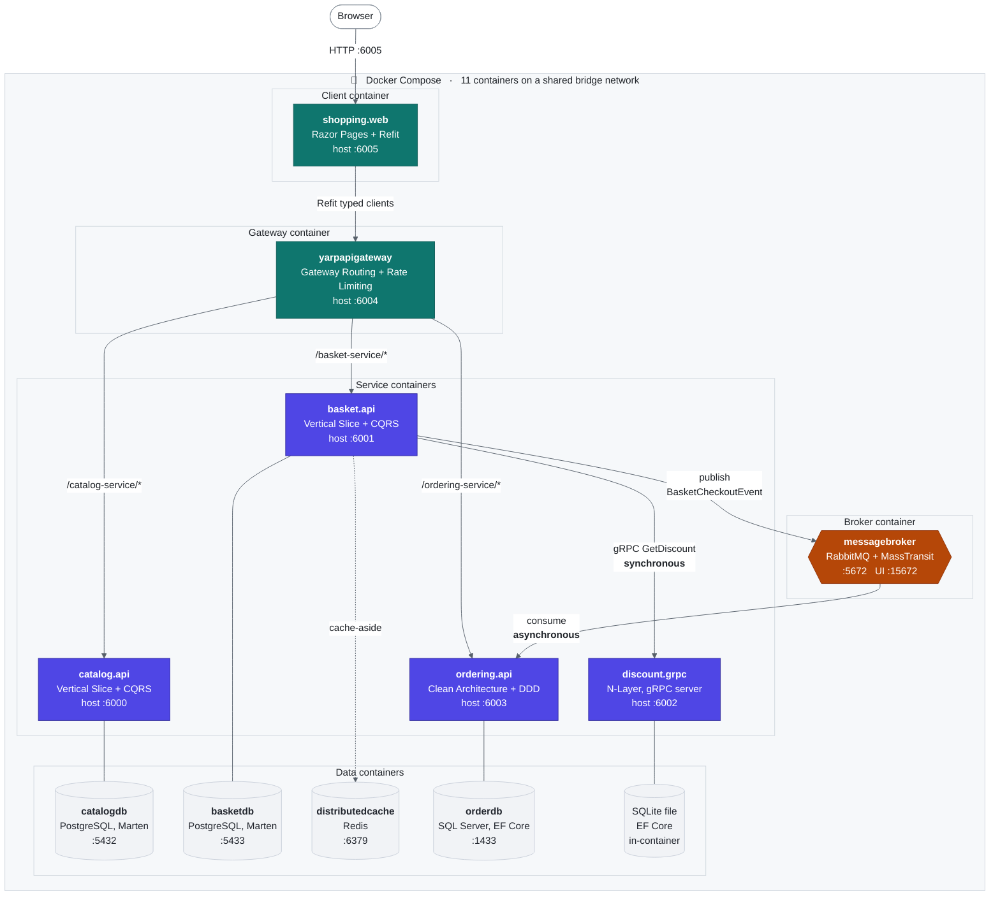
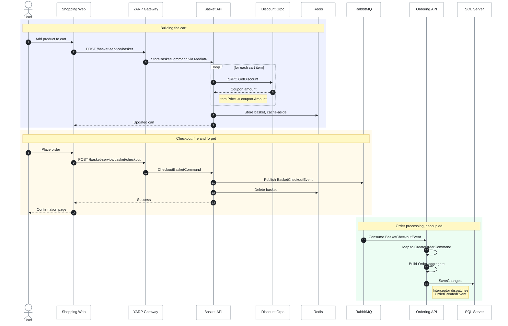

# E-Commerce Microservices Platform

A full-stack e-commerce application built with **.NET 8**, demonstrating a
production-style microservices architecture: four independent backend services, a
YARP API gateway, and a Razor Pages web client, all containerized with Docker Compose.

Each service is deliberately implemented in a **different architectural style**, so the
solution doubles as a side-by-side comparison of how these approaches play out in
practice.

---

## Architecture



Every box inside the boundary is a container declared in `docker-compose.yml` and built
from its own `Dockerfile`. `docker-compose.override.yml` wires them together by injecting
connection strings, gateway addresses and broker credentials as environment variables, so
no host or password is hard-coded in the images.

Containers reach each other by Compose service name on the internal network, never through
the published ports:

| From | To | Internal address |
|---|---|---|
| shopping.web | gateway | `http://yarpapigateway:8080` |
| gateway | catalog.api | `http://catalog.api:8080` |
| basket.api | discount.grpc | `http://discount.grpc:8080` |
| basket.api | Redis | `distributedcache:6379` |
| basket.api / ordering.api | RabbitMQ | `amqp://ecommerce-mq:5672` |

The `:6000` to `:6005` host ports shown in the diagram exist only so you can hit individual
services from your machine while debugging. A single `docker compose up` builds and starts
the entire system.

### The 11 containers

`docker-compose.yml` declares exactly eleven services: six application containers built
from source, and five infrastructure containers pulled from public images.

**Application containers** — built from a `Dockerfile` in this repo, all listening on
`8080` (HTTP) and `8081` (HTTPS) inside the network:

| # | Compose service | Image | Host ports | Role |
|---|---|---|---|---|
| 1 | `catalog.api` | `catalogapi` (built) | 6000, 6060 | Product catalog, vertical slices over Marten |
| 2 | `basket.api` | `basketapi` (built) | 6001, 6061 | Shopping cart, Redis cache-aside, publishes checkout events |
| 3 | `discount.grpc` | `discountgrpc` (built) | 6002, 6062 | gRPC discount server, SQLite file inside the container |
| 4 | `ordering.api` | `orderingapi` (built) | 6003, 6063 | Clean Architecture + DDD, consumes checkout events |
| 5 | `yarpapigateway` | `yarpapigateway` (built) | 6004 | Single entry point, routing + rate limiting |
| 6 | `shopping.web` | `shoppingweb` (built) | 6005 | Razor Pages storefront, talks only to the gateway |

**Infrastructure containers** — official images, `restart: always`:

| # | Compose service | Image | Host ports | Role |
|---|---|---|---|---|
| 7 | `catalogdb` | `postgres` | 5432 | Catalog document store, volume `postgres_catalog` |
| 8 | `basketdb` | `postgres` | 5433 → 5432 | Basket document store, volume `postgres_basket` |
| 9 | `distributedcache` | `redis` | 6379 | Basket distributed cache |
| 10 | `orderdb` | `mcr.microsoft.com/mssql/server` | 1433 | Ordering relational store (EF Core) |
| 11 | `messagebroker` | `rabbitmq:management` | 5672, 15672 | Event bus, hostname `ecommerce-mq`, management UI |

Discount has no database container of its own: it keeps a SQLite file inside its own
container, which is why the count is eleven rather than twelve.

Startup order is expressed with `depends_on`: `shopping.web` waits on `yarpapigateway`,
which waits on the three HTTP APIs; `basket.api` waits on `basketdb`,
`distributedcache`, `discount.grpc` and `messagebroker`; `catalog.api` on `catalogdb`;
`ordering.api` on `orderdb` and `messagebroker`.

### Checkout workflow

The full path a checkout takes through the system, showing where communication is
synchronous and where it is event-driven:



The user is never blocked on order creation. Basket returns as soon as the event is
published, and Ordering processes it independently, so the ordering service can be down
or restarting without breaking checkout.

### Architectural styles by service

| Service | Architecture | Key patterns |
|---|---|---|
| **Catalog.API** | Vertical Slice Architecture | CQRS, feature folders, Marten document DB |
| **Basket.API** | Vertical Slice Architecture | CQRS, Repository, Decorator, Cache-Aside |
| **Discount.Grpc** | N-Layer Architecture | gRPC services, EF Core, Protobuf contracts |
| **Ordering** | Clean Architecture + DDD | Aggregates, Value Objects, Domain Events, CQRS |

### Communication

- **Synchronous**: Basket calls Discount over **gRPC / Protocol Buffers** to resolve
  the final product price at cart time.
- **Asynchronous**: Basket publishes a `BasketCheckoutEvent` to **RabbitMQ** via
  **MassTransit**; Ordering subscribes and materializes the order. This decouples
  checkout from order processing entirely.

---

## Tech stack

**Backend**: .NET 8, ASP.NET Core Minimal APIs, gRPC, Carter, MediatR, FluentValidation, Mapster, Scrutor
**Frontend**: ASP.NET Core Razor Pages, Bootstrap, jQuery, Refit
**Data**: PostgreSQL (Marten document DB), SQL Server + SQLite (EF Core), Redis
**Messaging**: RabbitMQ, MassTransit
**Gateway**: YARP Reverse Proxy
**Infrastructure**: Docker, Docker Compose

---

## Services

### Catalog.API
Product catalog built as vertical slices. Each feature (`CreateProduct`,
`GetProductByCategory`, and so on) owns its command/query, handler, validator, and
endpoint in a single folder. Uses **Marten** for transactional document storage on
PostgreSQL, with Carter for endpoint registration.

### Basket.API
Shopping cart persisted as a document per user. A `CachedBasketRepository` **decorator**
(wired via Scrutor) layers Redis cache-aside on top of the base repository without the
handlers knowing about it. Calls Discount over gRPC, and publishes checkout events to
RabbitMQ.

### Discount.Grpc
A lean gRPC server exposing four RPCs (`GetDiscount`, `CreateDiscount`,
`UpdateDiscount`, `DeleteDiscount`) over Protobuf contracts, backed by SQLite through
EF Core with code-first migrations.

### Ordering
Clean Architecture across four projects: `Domain`, `Application`, `Infrastructure`,
`API`. The domain layer models orders as **DDD aggregates** with strongly-typed value
objects (`OrderId`, `CustomerId`, `Address`, `Payment`) and raises **domain events**
dispatched through an EF Core `SaveChanges` interceptor.

### YarpApiGateway
Single entry point applying the Gateway Routing pattern, with route/cluster/transform
configuration and a fixed-window **rate limiter** (5 requests / 10s) on the ordering
route.

### Shopping.Web
Server-rendered Razor Pages storefront covering product listing, product detail, cart,
checkout, and order history. It consumes the gateway through three **Refit** typed HTTP
clients.

---

## Cross-cutting concerns

Shared via the `BuildingBlocks` libraries:

- **CQRS abstractions**: `ICommand`, `IQuery`, and their handler interfaces
- **Pipeline behaviors**: `ValidationBehavior` (FluentValidation) and `LoggingBehavior`
  run around every MediatR request
- **Global exception handling**: `CustomExceptionHandler` maps domain and validation
  exceptions to RFC 7807 problem details
- **Health checks**: every service exposes `/health` with a UI-friendly response writer
- **Pagination**: shared `PaginatedResult<T>` / `PaginationRequest`

---

## Getting started

### Prerequisites

- [.NET 8 SDK](https://dotnet.microsoft.com/download/dotnet/8.0)
- [Docker Desktop](https://www.docker.com/products/docker-desktop) (allocate at least
  4 GB memory)
- [Visual Studio 2022](https://visualstudio.microsoft.com/downloads/) or
  [VS Code](https://code.visualstudio.com/) (optional)

### Run it

```bash
git clone https://github.com/Zack-Gtay/e-commerce-microservices.git
cd e-commerce-microservices/src
docker compose -f docker-compose.yml -f docker-compose.override.yml up -d
```

Give the databases a moment to finish initializing on first run. A couple of services
retry their connection until the containers are healthy.

### Endpoints

| Service | HTTP | HTTPS |
|---|---|---|
| Shopping Web UI | http://localhost:6005 | n/a |
| YARP API Gateway | http://localhost:6004 | n/a |
| Catalog API | http://localhost:6000 | https://localhost:6060 |
| Basket API | http://localhost:6001 | https://localhost:6061 |
| Discount gRPC | http://localhost:6002 | https://localhost:6062 |
| Ordering API | http://localhost:6003 | https://localhost:6063 |
| RabbitMQ dashboard | http://localhost:15672 | n/a |

RabbitMQ dashboard credentials are `guest` / `guest`.

Checking out a basket from the web UI publishes a message you can watch land on the
RabbitMQ dashboard before Ordering consumes it.

---

## Project structure

```
src/
├── ApiGateways/
│   └── YarpApiGateway/           # YARP reverse proxy + rate limiting
├── BuildingBlocks/
│   ├── BuildingBlocks/           # CQRS, behaviors, exceptions, pagination
│   └── BuildingBlocks.Messaging/ # MassTransit config, integration events
├── Services/
│   ├── Catalog/Catalog.API/      # Vertical Slice + CQRS
│   ├── Basket/Basket.API/        # Vertical Slice + Redis cache-aside
│   ├── Discount/Discount.Grpc/   # N-Layer gRPC service
│   └── Ordering/                 # Clean Architecture + DDD
│       ├── Ordering.Domain/
│       ├── Ordering.Application/
│       ├── Ordering.Infrastructure/
│       └── Ordering.API/
└── WebApps/
    └── Shopping.Web/             # Razor Pages client
```

---

## Roadmap

- Authentication and authorization (ASP.NET Core Identity / JWT). The UI currently
  assumes a fixed customer id
- Move connection strings out of `appsettings.json` into environment variables and
  user-secrets
- Integration and unit test coverage
- Structured logging and distributed tracing (Serilog, OpenTelemetry)
- Kubernetes manifests / Helm chart

---

## License

Licensed under the MIT License. See [LICENSE](LICENSE).
